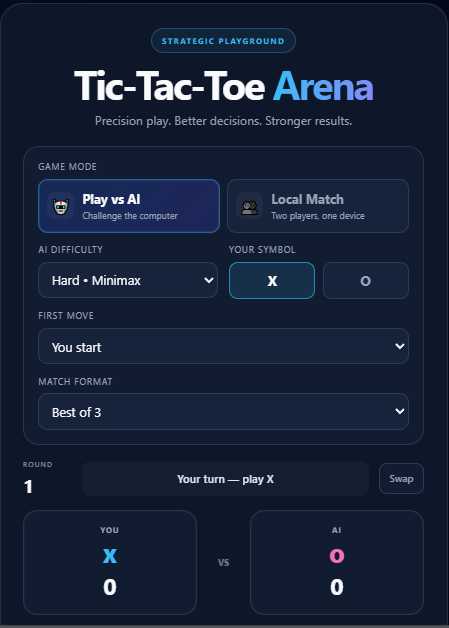
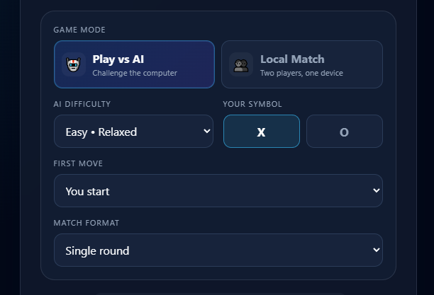
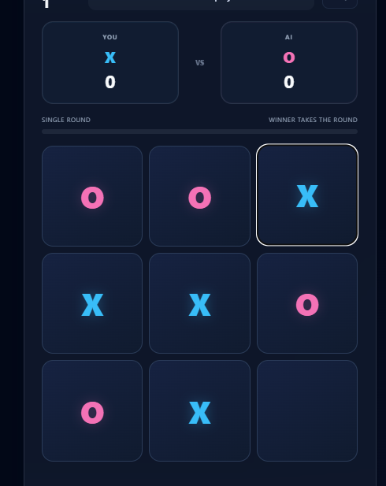
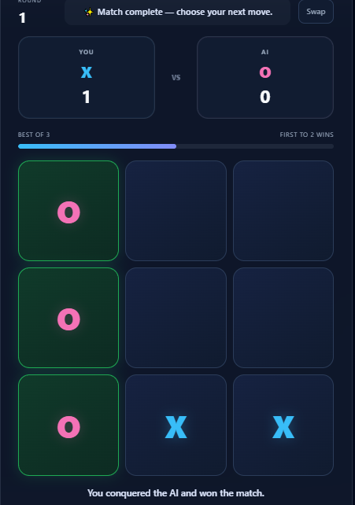
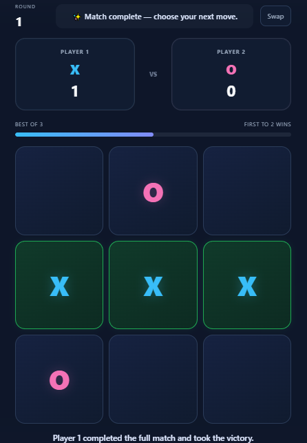
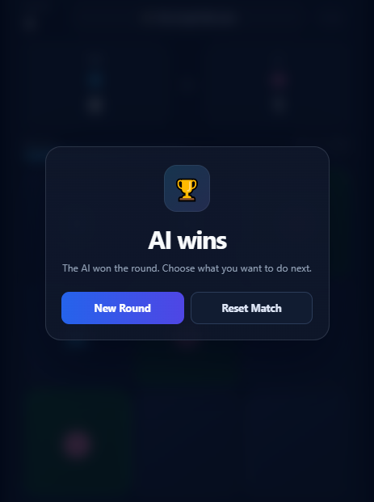
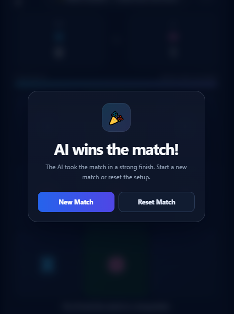

# 🎮 Tic-Tac-Toe Arena

A modern browser-based Tic-Tac-Toe game built as part of the **CodeOrbit Internship**.  
The project combines a clean responsive interface with multiple game modes, configurable AI difficulty, match formats, score tracking, and a local multiplayer mode.

## ✨ Features

### 🤖 Play Against AI
- Play Tic-Tac-Toe against the computer.
- Choose your symbol: **X** or **O**.
- Swap X/O before starting a match.
- Select AI difficulty:
  - **Easy** – random move selection.
  - **Medium** – tactical play that tries to win, block the player, take the center, and prefer corners.
  - **Hard** – uses the **Minimax algorithm** for strategic decision-making.
- Choose who makes the first move:
  - You start
  - AI starts
  - Random

### 👥 Local Multiplayer
- Play with a friend on the same device.
- Player 1 uses **X** and Player 2 uses **O**.
- Choose the first player or use random starter selection.

### 🏆 Match System
- **Single Round**
- **Best of 3**
- **Best of 5**
- Live score tracking for both sides.
- Match progress bar.
- Round number tracking.
- Automatic match completion when the required number of wins is reached.

### 🎯 Game Experience
- Start Match setup flow.
- New Round and Reset Match controls.
- Winner-line highlighting.
- Draw detection.
- Result messages after each round.
- Match completion celebration animation.
- Responsive layout for smaller screens.
- Settings are locked while a match is in progress to prevent accidental changes.

## 🧠 AI Logic

The AI uses three difficulty levels:

**Easy:**  
Chooses an available cell randomly.

**Medium:**  
Uses tactical rules to:
1. Win when a winning move is available.
2. Block the player's winning move.
3. Choose the center when possible.
4. Prefer an available corner.
5. Fall back to a random move.

**Hard:**  
Uses the **Minimax algorithm** to evaluate possible future board states and select the strongest available move.

This satisfies the internship requirement for an AI opponent using rule-based logic and Minimax.

## 🛠️ Technologies Used

- **HTML5** – game structure and semantic page layout
- **CSS3** – responsive UI, animations, gradients, modal design, and game-board styling
- **JavaScript** – game logic, AI, Minimax, score system, match flow, and UI interactions

## 📂 Project Structure

```text
Tic-tac-toe/
│
├── index.html
├── style.css
├── script.js
└── screenshots/
    ├── 01-main-interface.png
    ├── 02-game-settings.png
    ├── 03-ai-hard-minimax-gameplay.png
    ├── 04-symbol-swap-and-difficulty.png
    ├── 05-local-multiplayer.png
    ├── 06-round-result.png
    └── 07-match-complete.png
```

## ▶️ How to Run

1. Download or clone this repository.
2. Open the project folder.
3. Open `index.html` in any modern web browser.
4. Choose a game mode and configure the settings.
5. Click **Start Match** and play.

No server or external library is required.

## 📸 Screenshots

### 1. Main Interface


### 2. Game Settings


### 3. AI Gameplay – Hard / Minimax


### 4. Symbol & Difficulty Options


### 5. Local Multiplayer


### 6. Round Result


### 7. Match Complete


## 📌 Internship Task

This project was developed for the **CodeOrbit Internship** Tic-Tac-Toe task.

### Task Goals Covered
- Build a Tic-Tac-Toe game.
- Allow the user to play against a computer.
- Implement an AI opponent using simple rules and/or Minimax.
- Display an interactive game board.
- Handle win, lose, and draw conditions.
- Provide a usable and responsive interface.

### Additional Features Added
- Multiple AI difficulty levels.
- Minimax-based hard AI.
- Local multiplayer mode.
- X/O selection and swap option.
- First-move selection.
- Single, Best of 3, and Best of 5 formats.
- Scoreboard and match progress.
- Round management.
- Result modal and celebration animation.
- Responsive design.

## 🚀 Future Improvements

- Add sound effects and background music controls.
- Add player names for local multiplayer.
- Add persistent score/history using local storage.
- Add online multiplayer using a backend or WebSocket connection.
- Add AI statistics and move analysis.
- Add theme customization.

## 👨‍💻 Author

**Logith G**

Built with **HTML, CSS, and JavaScript** as part of the **CodeOrbit Internship**.
